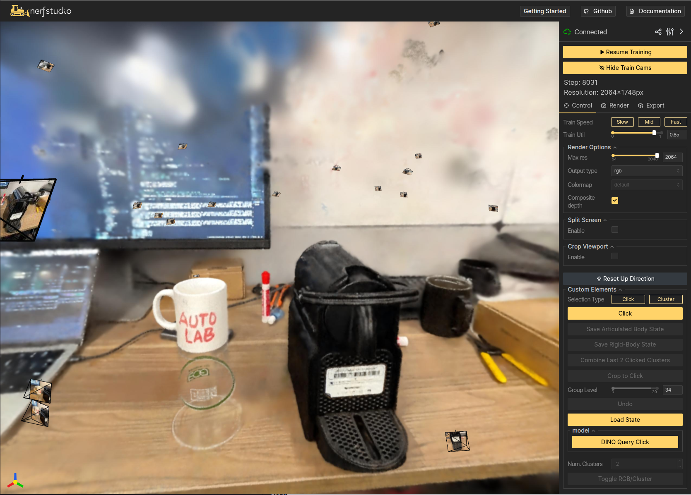
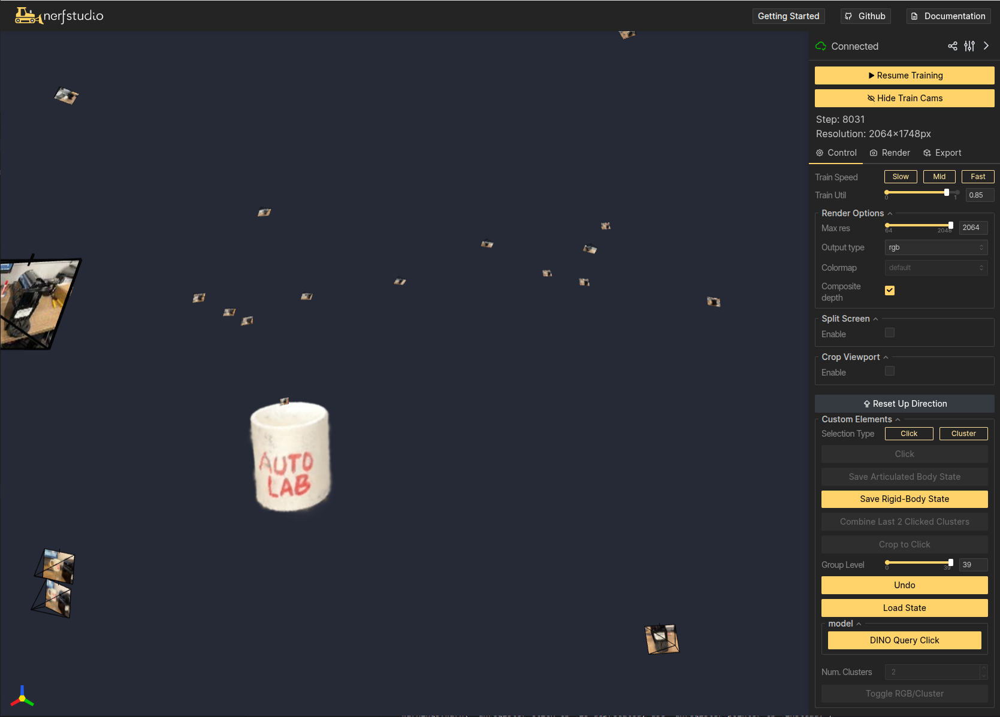
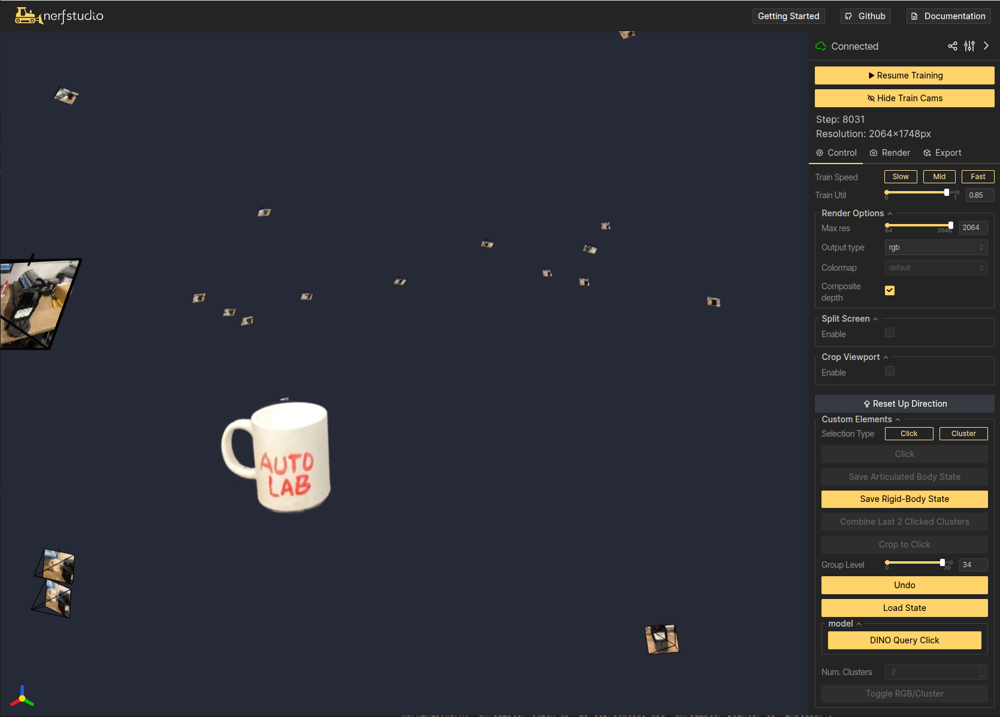
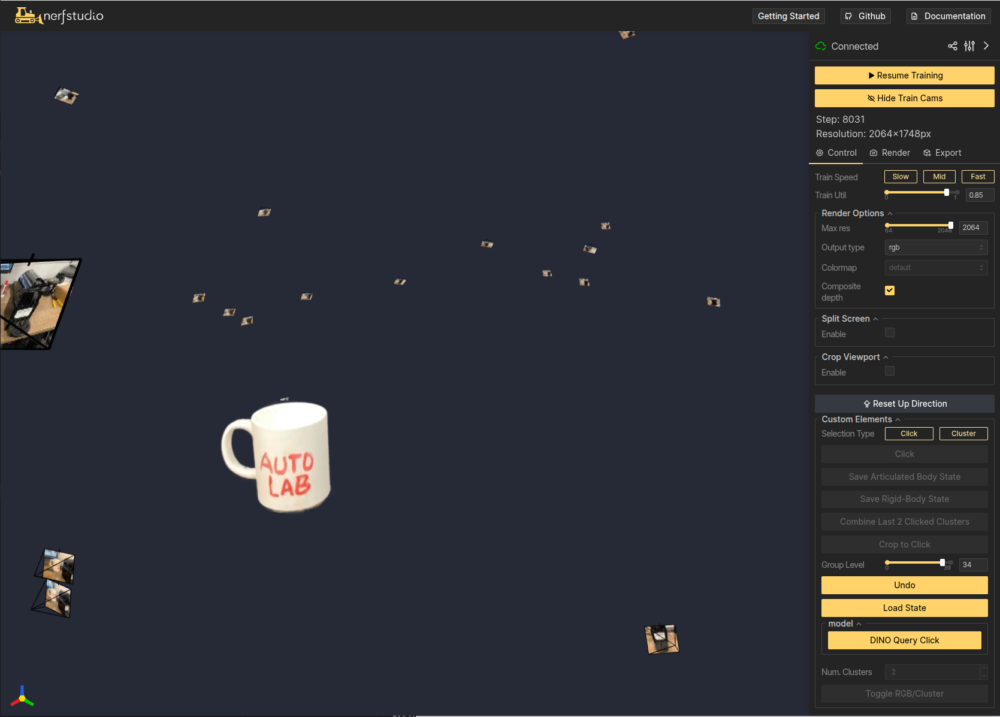

# Real2Render2Real
**Scaling Robot Data Without Dynamics Simulation or Robot Hardware**

[Project Page](https://real2render2real.com) | [arXiv](https://arxiv.org/abs/2505.09601)

Justin Yu*, Letian Fu*, Huang Huang, Karim El-Refai, Rares Ambrus, Richard Cheng, Muhammad Zubair Irshad, Ken Goldberg

University of California, Berkeley | Toyota Research Institute
*Equal contribution

## TODOs
- [X] **September 22nd, 2025:** Initial release (real-to-sim pipeline, data generation pipeline, assets dataset, policy training infrastructure)
- [ ] **Coming Soon!** Release converted datasets for diffusion policy and π₀-FAST to Hugging Face
- [ ] Integrate GraspNet-baseline for better grasp generation

## Overview 
**TLDR;** Real2Render2Real (R2R2R) is a scalable pipeline for generating data to train generalist manipulation policies - without dynamics simulation or teleoperation. 

https://github.com/user-attachments/assets/ef32378b-fdcd-4682-b27e-dee6881bd75c


The code used in this project to deploy high-frequency visuomotor policies on the YuMi IRB14000 robot is hosted on repo [uynitsuj/yumi_realtime](https://github.com/uynitsuj/yumi_realtime)

## Installation
Clone the repo and its submodules with: 
```bash
git clone --recursive https://github.com/uynitsuj/real2render2real.git
```
The submodules will be installed in [`dependencies/`](dependencies/).

We have three environments for each step in the pipeline: real-to-sim asset and trajectory extraction, 3DGS-to-mesh, and data generation.  

If you want to go directly to data generation, unzip `outputs.zip` and `data.zip` in the root of the repo and head to [Data Generation](#data-generation). 

## Real-to-Sim Asset and Trajectory Extraction

Set up your environment using conda and follow the install steps in [env_real_to_sim.sh](env_real_to_sim.sh)

The scans and demonstrations for all of our objects and tasks can be found [here](https://drive.google.com/drive/folders/1i3NFvjleSeClqEq7wNnIMyBFIAZW-3b0?usp=sharing).
We additionally provide all of the outputs from our asset and trajectory extraction in `outputs.zip` found [here](https://drive.google.com/drive/folders/14I_Y66uaiAbUDb5nO-uf_mLw4_OBgvdQ?usp=sharing) if you want to better follow along or go directly to [data generation](#data-generation). 

Set up the conda environment for running real-to-sim by following the install outlined in `env_real_to_sim.sh`. 
 
### Using Custom Data
To capture your own objects you should follow [this guide](https://docs.nerf.studio/quickstart/custom_dataset.html). All of our objects were captured using a LiDAR-supported iPhone with Polycam. For your demonstration videos we recommend recording it in a similar manner as we have done [here](https://drive.google.com/drive/folders/1i3NFvjleSeClqEq7wNnIMyBFIAZW-3b0?usp=sharing). 

### Training 4D-DPM
Note: if you aren't training from scratch and are using our provided GARField and DiG outputs you will have to edit the data path to reflect the scan's path on your machine in the `config.yml` for GARField and DiG.  

1) **Train GARField** We train GARField for 8000 steps by running the following in the root of the repo: `ns-train garfield --data <path/to/datasetname>`. This will produce an output config file inside `output/datasetname/garfield/<timestamp>/config.yml`. Example run:
```
ns-train garfield --data jy_scans/coffee_maker
```

2) **Train DiG**  We then train DiG for 8000 steps, once again running in the root of the repo: `ns-train dig --data <path/to/data/directory> --pipeline.garfield-ckpt <path/to/config.yml>`, using the output config file from the GARField training. Example run:
```
ns-train dig --data jy_scans/coffee_maker  --pipeline.garfield-ckpt outputs/coffee_maker/garfield/2025-02-16_195942/config.yml
```

3) **Segment the model**: inside the viewer for DiG, you should see the following GUI:

First we need to segment the model. To do this, click on the "Click" button, then click inside the viewer window to select a point in 3D. Next, click "Crop to Click". You should see a result like this:

Next adjust the group level until only the object is segmented, like this:

For a rigid object, you will just press "Save Rigid-Body State". For an articulated object switch to "Cluster" mode, then click "Cluster Scene" try to pick a scale such that the fewest parts are segmented while maintaing the part of interest. You can cluster multiple times, only the final clusters are saved. Then press "Save Articulated Body State". For visual clarity check out Robot See Robot Do's explanation: https://github.com/uynitsuj/rsrd?tab=readme-ov-file#training-4d-dpm

If you want to segment multiple rigid objects you will have to then press "Undo" and repeat the process for the next object. Each clustered object can be found in `outputs/datasetname/state_rigid_<timestamp>`.

### Reconstructing Video Motion
We require hand tracking to sample grasps so please follow the steps to install [HaMeR](https://github.com/geopavlakos/hamer), this will involve downloading model weights. Make sure that their [demo script](https://github.com/geopavlakos/hamer?tab=readme-ov-file#demo) runs properly before continuing!  

Example run:
```bash
conda activate r2r2r_rsrd
python dependencies/rsrd/scripts/run_tracker.py  --is-obj-jointed False --dig-config-path outputs/cardboard_box/dig/2025-04-18_204749/config.yml  --video-path jy_demonstrations/cardboard_box_lift.MOV --output-dir outputs/cardboard_box/track --save-hand`
```


## 3DGS-to-Mesh
Set up the conda environment for running SuGaR by following the steps in [env_3dgs_to_mesh.sh](env_3dgs_to_mesh.sh)

Training SuGaR:
```
conda activate r2r2r_sugar
python dependencies/SuGaR/full_train_pipeline.py -s /home/lifelong/code_release/realrenderreal/outputs/cardboard_box/state_rigid_20250418_205353
```

After creating the mesh the normals may not be correct and the grasps generated initially from RSRD might not be the best. We refine these by running:

```
conda activate r2r2r_rsrd
python dependencies/rsrd/scripts/dev_grasp.py --dig-config /home/lifelong/code_release/realrenderreal/outputs/cardboard_box/dig/2025-04-18_204749/config.yml
```
This will produce a mesh with updated normals called `<mesh_name>_fixed_normals_centered.obj` and generate a new `track` folder. Ensure that the `track` folder is named just `track`.

## Data Generation
The environment for data generation is managed using [uv](https://docs.astral.sh/uv/). The instructions for manual installation are included in [env_data_gen.sh](env_data_gen.sh).

### Preparing Data for IsaacLab
Download and unzip data.zip from [here](https://drive.google.com/drive/folders/14I_Y66uaiAbUDb5nO-uf_mLw4_OBgvdQ?usp=sharing) into the root of the repo. This contains all of the assets we use for our tasks. If you haven't already, also download outputs.zip from [here](https://drive.google.com/drive/folders/14I_Y66uaiAbUDb5nO-uf_mLw4_OBgvdQ?usp=sharing) into the root of the repo. These are all of our tracked and grouped objects along with their meshes (this folder is ~50GB unzipped).

If you're using a new asset mesh you will have to convert it into a usd by running a variation of the following:
```
source .venv/bin/activate
python dependencies/IsaacLab/scripts/tools/convert_mesh.py outputs/cardboard_box/state_rigid_20250418_205353/sugarfine_3Dgs7000_
densityestim02_sdfnorm02_level005_decim200000_normalconsistency01_gaussperface6_fixed_normals_centered.obj outputs/cardboard_box/state_rigid_20250418_205353/usd/sugarfine_3Dgs7000_densityestim02
_sdfnorm02_level005_decim200000_normalconsistency01_gaussperface6_fixed_normals_centered.usd --make-instanceable --collision-approximation none --mass 1.0
```
Then make sure to include the path of the usd you want to use in the `[robot]_scene_cfg.py` for the given task.

### Running Data Generation
You can run data generation by running:
```
python scripts/run.py
```
Uncomment the `scene_config` and `simulator` of the environment you want to simulate.

This will generate a series of folders in `output_data/<task_name>/` with `output_data/<task_name>/successes/` being successful rollouts that you should use for training.

### Table Randomization
To do table randomization you will need to go to [vMaterials](https://developer.nvidia.com/vmaterials) and make an NVIDIA developer account. If you're using linux select `vMatierals X.Y for Linux` and it will install a `.run` executable. In a terminal run `chmod +x <executable>.run` then `sudo ./<executable>.run` it will then ask if you want to set system-global files to set the variable "MDL_USER_PATH" to "/opt/nvidia/mdl/vMaterials_2/" we selected yes. Now in whatever simulator you're using make sure to uncomment `randomize_table()` and run `source .venv/bin/activate && python scripts/run.py` in a new terminal! 

## Policy Training

For π₀-FAST policy training see https://github.com/Max-Fu/openpi/tree/main for details. You will need to convert the generated R2R2R data into the proper format using this script: [convert_dpgs_data.py](https://github.com/Max-Fu/openpi/blob/main/scripts/convert_dpgs_data.py) 

For diffusion policy training see https://github.com/Max-Fu/tinydp for details.

## Common Issues
- `No module named vitpose_model` in `_hamer_helper.py`: you can edit the file and include the following lines below `hamer_directory = ...`
```
import sys
sys.path.insert(0, str(hamer_directory.absolute()))
from vitpose_model import ViTPoseModel
```  
- "ValueError: ``target_reduction`` must be between 0 and 1" when performing analytical grasp sampling & scoring: this may be due to an outdated trimesh version. To resolve this, try changing `_mesh = _mesh.simplify_quadric_decimation(150)` in line 315 in `dependencies/rsrd/rsrd/robot/graspable_object.py` to `_mesh.simplify_quadric_decimation(face_count=150)`
- If you encounter issues with gsplat not building correctly try uninstalling gsplat and reinstalling with this command: 
```
NVCC_FLAGS="-gencode=arch=compute_80,code=sm_80 -gencode=arch=compute_80,code=sm_80" pip install git+https://github.com/nerfstudio-project/gsplat.git@v1.4.0
``` 
- Viser import "No module named 'websockets.asyncio': Consult [asyncio_error.md](asyncio_error.md) for steps to debug.
- Cannot import cmake when running `./isaaclab.sh --install`: try to make sure it is pointing to a compiled cmake and not one installed from pip. 

## Bibtex
If you find this useful, please cite the paper!
<pre id="codecell0">@misc{yu2025real2render2realscalingrobotdata,
      title={Real2Render2Real: Scaling Robot Data Without Dynamics Simulation or Robot Hardware}, 
      author={Justin Yu and Letian Fu and Huang Huang and Karim El-Refai and Rares Andrei Ambrus and Richard Cheng and Muhammad Zubair Irshad and Ken Goldberg},
      year={2025},
      eprint={2505.09601},
      archivePrefix={arXiv},
      primaryClass={cs.RO},
      url={https://arxiv.org/abs/2505.09601}, 
} </pre>
